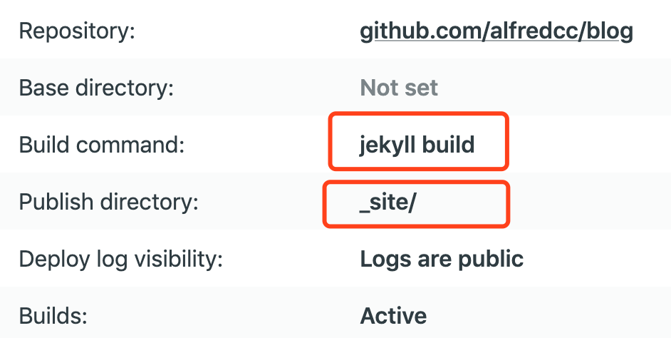

经历了两天的折腾终于把我的博客搭建成功了👏🧨。
整个过程虽然踩了很多坑，但最终的结果很令我满意，而且这个过程也是一个非常值得分享的事情。先简单介绍下我的博客主要使用 Jekyll + Github + Netlify + VSCode（用来写 Markdown）的框架来搭建，然后就直接上正菜吧！

> 直白的“来承上启下”

## 静态网站生成器

都 2020 年了，搭建一个博客当然是非常简单的事情。不需要什么复杂的框架，也不需要购买服务器，直接把生成静态文件丢到 CDN 就好了，性能又高，维护成本又低，而且更加安全。当然如果要自己搭服务器当然也可以，但国内的环境我就不说了，备案各种事情会让你崩溃，可以看下之前公司小伙伴`萌哥`的辛酸史 [申请域名的艰难之路](https://mengtnt.com/2020/02/11/submit-domain.html) 。

继续说说静态网站生成器，这个名词很早就有了，感兴趣的小伙伴可以听下 [内核恐慌的这期](https://pan.icu/3) 节目。现在大多的开源博客软件都用到了之类的技术，这种方案其实就是之前比较火的 [JAMStack](https://jamstack.org/)。

> JAMStack（JAM 代表 **J**avaScript，**A**PI 和 **M**arkup）是一种使用 [Static Site Generators](https://link.zhihu.com/?target=https%3A//www.staticgen.com/) (SSG) 技术、不依赖 **Web Server** 的前端架构。 

目前比较流行的博客搭建框架有 `Jekyll, Hugo, Nuxt, Next, Gatsby`，至于我为什么用 `Jekyll` 呢？其实我自己也没有仔细横向比对过，主要原因可能是我比较喜欢 Ruby 这门语言吧（确切的说应该是 ruby 社区的开源精神/文化）。之前看喵神也把博客迁回了 `Jekyll` 所以就毫不犹豫选了它。

## 数据管理和迁移

以前很多小伙伴用了 `WordPress` 去搭建博客，既要架服务器，又要搭建数据库，一旦需要迁移站点就非常痛苦，你一波骚操作有可能把辛苦写的文章数据都删除了。但因为我们使用的是 JAMStack 方案，根本不存在数据库，而且所有文章都有 `git` 提交记录（除非你把 `git` 项目删了），所以不太可能丢数据。迁移的时候只要简单的 Copy/Poast 相关文章的文件就可以了。

## 流程自动化

由于我们使用了`静态网站生成器`每次写完文字都需要运行一遍 build 命令(比如`jekyll build`)重新生成一遍静态资源。所以就需要把这些重复的流程自动化，也就是 CI 自动部署。我用的是 Netlify 的免费版（300 次 build 的免费对于我这个可能月更的博客站点完全够用了），而且配置非常简单：直接向 Github 授权，然后选择你的 blog 项目就可以了，如果你项目使用了 Jekyll ，Netlify 会自动识别到，并且默认就帮你配置好了 Build 选项，简直黑科技！

当然我们也可以使用 [Github Action](https://jekyllrb.com/docs/continuous-integration/github-actions/) 来做 CI 也很香。这样我们写完博客直接往 github 已提交，系统就自动帮我们生成好静态资源并部署到 CDN 上了。

## 评论系统
之前看到很多博客站使用 `disqus` 虽然集成也方便，但是广告多加载又慢，当我看到[utterances](https://utteranc.es/) 这个开源工具就爱上了，果断放弃 `disqus`，`utterances`是一款基于 GitHub issues 的评论工具，优点如下：
1. 轻量
2. 加载非常快
3. 配置简单
4. 这种 ✨✨设计风格的 logo 很符合我的胃口

## 静态资源托管
因为我们的网站是托管在 CDN 上的，访问速度的快慢主要就依赖你所托管的 CDN 服务商的速度，所以如果我们想优化国内的访问速度就需要尽量选择国内的托管服务（可惜好像没有特别好的）。

具体你可以参考这里:
<a href="https://github.com/lmk123/blog/issues/55" target="_blank" rel="">介绍一些免费好用的静态网站托管服务</a>

## 最后
整个过程搭建完毕，然后我们只要打开熟悉的 VSCode 安装上 markdown 插件就可以愉快的写博客啦。

当然如果你想更加深度定制你的 blog 网站，作为一个程序员👨‍💻‍肯定难不倒你，我们可以基于一些开源的 Theme 上做适当的修改，比如加一个侧边栏，给头像增加一点动效等（笔者也在这个主题上定制了一些自己的需求并且提交了 PR）。另外我们也可以用一些 `Serverless` 的服务比如 [google cloud function](https://cloud.google.com/functions) 用来弥补我们没有后端的尴尬场面，具体需求就靠大家自由发挥才智了。

推荐一些相关资源：
[Jekyll Themes](https://jamstackthemes.dev/ssg/jekyll/)

